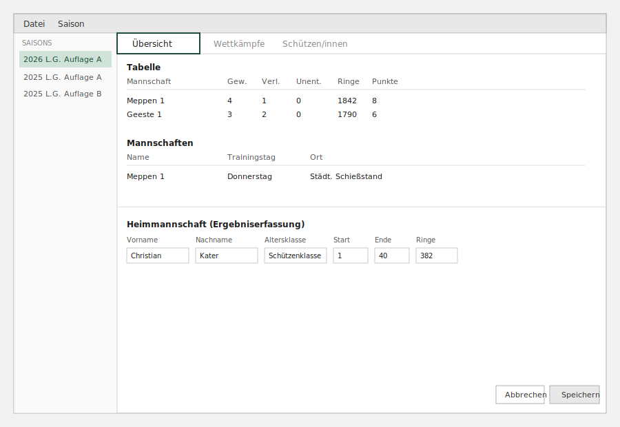
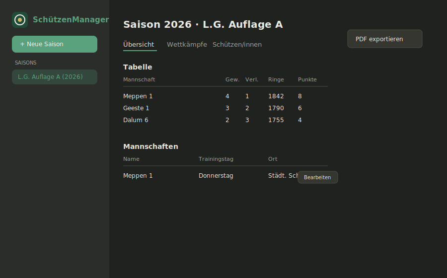

  

Verwaltung von Rundenwettkampf-Saisons für Schießsportvereine: Mannschaften, Ergebniserfassung, automatische Tabellen- und Einzelwertungsberechnung, PDF-Export und Web-Sync.

Ursprünglich entwickelt von **Christian Kater** als Java-8/JavaFX-Desktop-Projekt für den Schützenkreis Meppen (siehe [Legacy/](Legacy/)). Wird aktuell auf einen modernen, plattformunabhängigen Stack migriert — siehe [TECHNICAL.md](TECHNICAL.md) für Architektur, Setup und den Migrationsstand.

## Funktionen

- Saisonverwaltung: neue Rundenwettkampf-Saison anlegen, automatischer Spielplan per Round-Robin
- Ergebniserfassung pro Match (Heim-/Gastmannschaft, bis zu 4 Schützen + Ersatzschützen)
- Automatische Tabellen- und Einzelwertungsberechnung
- Mannschaftsverwaltung inkl. Umbenennung mit automatischer Nachführung
- PDF-Export (Termine, Gesamtergebnis, Einzelergebnisse)
- Web-Sync mit zentralem Dienst für Vereine/Zuschauer

## So sieht es aktuell aus (Java/JavaFX)

  

*Nachbau anhand der FXML-Layouts, kein Live-Screenshot — die App läuft nur unter Java 8 und startet in dieser Umgebung nicht.*

## Wohin die Reise geht (Rework, in Arbeit)

  

*Design-Mockup der Ziel-Optik — Phase 1 (Saison mit automatischem Spielplan anlegen, Ergebnis erfassen, Tabelle/Einzelwertung live berechnen, Mannschaften bearbeiten) ist im [Rework/](Rework/)-Frontend komplett lauffähig und manuell durchgetestet; UI-Feinschliff folgt in weiteren Phasen.*

## Status

| Bereich | Stand |
|---|---|
| Legacy (Java/JavaFX) | funktionsfähig, unverändert in [Legacy/](Legacy/) |
| Rework — Backend (Fastify + Prisma) | Saison anlegen (inkl. automatischem Spielplan), Ergebniserfassung, Tabelle, Einzelwertung, Mannschaft bearbeiten, PDF-Export, Migrationsskript für `database.db` — alles verifiziert |
| Rework — Frontend (React + Vite) | **Phase 1 + 2 komplett**: Saisonliste, Saison-Erstellung, Ergebniserfassung, Tabelle/Einzelwertung, Mannschaftsverwaltung, PDF-Export |
| Rework — Desktop-Hülle (Tauri) | noch offen (Rust-Toolchain nötig) |
| Zentrales Hosting | geplant, noch nicht umgesetzt |

## Lizenz / Copyright

Der ursprüngliche Java-Code (© Christian Kater) steht unter der in [LICENSE](LICENSE) genannten Lizenz. Logo und Rework-Markenzeichen: © 2026 Fabian L.
