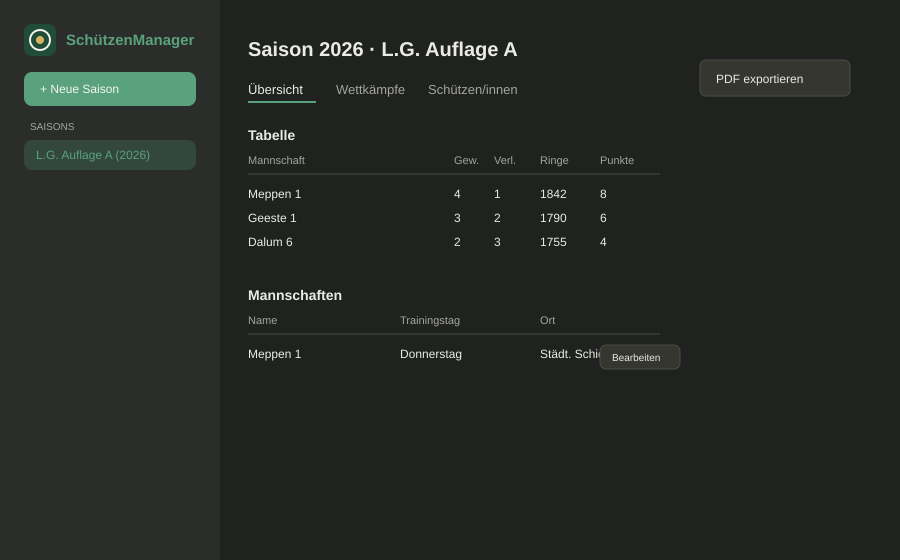
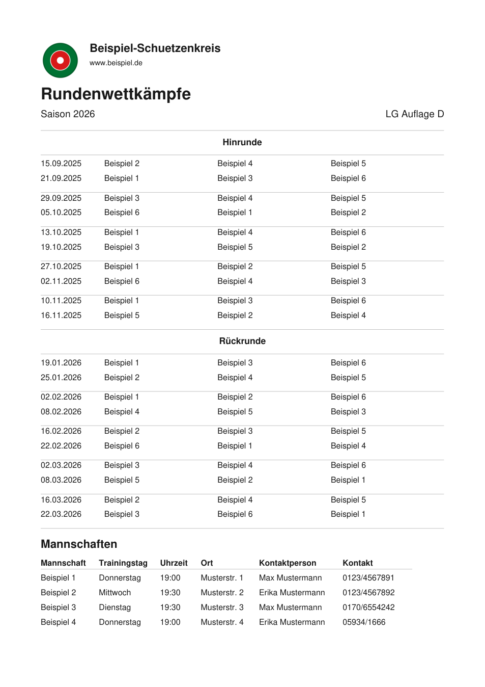

<p align="center">
  
</p>

<p align="center">
  <strong>Rundenwettkämpfe verwalten – von der Saisonplanung bis zum fertigen Spielplan-PDF.</strong>
</p>

<p align="center">
  <a href="../../releases/latest"></a>
  <a href="../../actions/workflows/ci.yml"></a>
  
</p>

---

**SchützenManager** verwaltet Rundenwettkampf-Saisons für Schießsportvereine: Mannschaften anlegen, Ergebnisse erfassen, Tabellen und Einzelwertungen automatisch berechnen und den Spielplan als PDF ausgeben.

Die App läuft **ohne Installation von Zusatzsoftware** – Datenbank und alles Nötige sind enthalten. Die lokalen Daten werden verschlüsselt gespeichert.

<table>
<tr><td width="50%" valign="top">

### 📋 Saison & Wettkämpfe
- Saison anlegen, Spielplan mit Hin- und Rückrunde wird automatisch erzeugt
- Ergebnisse je Begegnung erfassen (4 Schützen pro Seite + Ersatz)
- Tabelle und Einzelwertung berechnen sich live mit
- Ansicht wahlweise nach **Woche** oder **Hin-/Rückrunde**
- Begegnungen per Ziehen in eine andere Woche verschieben

</td><td width="50%" valign="top">

### 📄 Ausgabe & Verwaltung
- **PDF-Spielplan** im gewohnten Vereinslayout
- Eigener **PDF-Kopf mit Logo** – frei einstellbar
- Termine je Woche (Heim- und optional Gasttag)
- Mannschaftsdaten: Trainingszeit, Ort, Ansprechpartner
- Optionaler **Web-Zugriff** für Vereine und Zuschauer

</td></tr>
</table>

## Vorschau

<table>
<tr>
<td width="55%" valign="top" align="center">

**Oberfläche**



</td>
<td width="45%" valign="top" align="center">

**Exportierter Spielplan**

<a href="docs/images/beispiel-spielplan.pdf"></a>

<sub>Echter Export mit Beispieldaten – [als PDF öffnen](docs/images/beispiel-spielplan.pdf)</sub>

</td>
</tr>
</table>

## Installation

Die fertige App gibt es unter **[→ Releases](../../releases/latest)**.

<details open>
<summary><strong>Windows</strong> (empfohlen)</summary>

1. Auf der [Releases-Seite](../../releases/latest) unter „Assets" die Datei **`SchutzenManager_….x64-setup.exe`** herunterladen.
2. Die Datei **doppelklicken**.
3. Es erscheint ein blaues Fenster **„Der Computer wurde durch Windows geschützt"** (SmartScreen).
   → Auf **„Weitere Informationen"** klicken, dann auf **„Trotzdem ausführen"**.
   *Das ist normal* – siehe [Ist das sicher?](#ist-das-sicher) weiter unten.
4. Den Assistenten mit **„Weiter" / „Installieren"** durchklicken.
5. Die App über das **Startmenü** starten (nach „SchützenManager" suchen).

**Ohne Installation:** Stattdessen `SchuetzenManager-portable-windows-x64.zip` herunterladen, entpacken und darin `schuetzenmanager.exe` starten.

</details>

<details>
<summary><strong>Linux</strong></summary>

- **Debian / Ubuntu:** `.deb` herunterladen und installieren:
  ```bash
  sudo dpkg -i SchutzenManager_*_amd64.deb
  ```
- **Andere Distributionen:** `.AppImage` herunterladen, ausführbar machen und starten:
  ```bash
  chmod +x SchutzenManager_*.AppImage && ./SchutzenManager_*.AppImage
  ```

</details>

<details>
<summary><strong>Server / zentrales Hosting</strong> (optional)</summary>

Für den Betrieb mit mehreren Vereinen und Web-Zugriff gibt es ein eigenständiges Docker-Image unter `ghcr.io/einfachfabstv/schuetzenmanager-server` (eigener `server-v*`-Release-Kanal). Details in [TECHNICAL.md](TECHNICAL.md).

</details>

### ⚠️ Beim ersten Start

Du legst ein **Passwort** fest und bekommst einen **Wiederherstellungscode** angezeigt. Damit wird deine lokale Datenbank verschlüsselt.

> **Notiere den Wiederherstellungscode und bewahre ihn sicher auf – am besten ausgedruckt.**
> Er ist die einzige Möglichkeit, an deine Daten zu kommen, falls du das Passwort vergisst. Es gibt keine Hintertür – auch nicht für die Entwickler.

## Erste Schritte

Beim ersten Öffnen startet eine **geführte Tour**, die alles direkt in der App erklärt. Sie setzt automatisch fort, sobald du eine Saison öffnest, und ist jederzeit über *Einstellungen → Programm-Tour* wiederholbar.

Zum Nachlesen:

| Schritt | Wo | Was |
|---|---|---|
| **1. Saison anlegen** | Sidebar → *+ Neue Saison* | Jahr, Bezeichnung (z. B. „LG – Auflage D") und Mannschaften eintragen. Der Spielplan entsteht automatisch. |
| **2. PDF-Kopf einrichten** | *Einstellungen → PDF-Kopf* | Vereinsname, Website und Logo. Das Logo wird in der Datenbank gespeichert – die Bilddatei kannst du danach löschen. |
| **3. Termine eintragen** | *Termine & Info* | Je Wettkampfwoche ein Heimtag und optional ein Gasttag. Beide erscheinen im PDF. |
| **4. Mannschaften pflegen** | *Übersicht* | Trainingstag, Uhrzeit, Ort, Ansprechpartner und Telefonnummer. |
| **5. Ergebnisse erfassen** | *Wettkämpfe* | Begegnung anklicken, Ringe eintragen, speichern. Tabelle und Einzelwertung aktualisieren sich sofort. |
| **6. PDF exportieren** | *PDF-Export* | Abschnitte auswählen und über „Speichern unter" ablegen. |

## Automatische Updates

Die App prüft beim Start im Hintergrund, ob eine neuere Version vorliegt:

- **Optionales Update** – Hinweis mit „Jetzt aktualisieren" / „Später".
- **Pflicht-Update** – bei wichtigen Änderungen ein deutlicher, nicht wegklickbarer Hinweis. Die App bleibt trotzdem nutzbar.

**Deine Daten gehen dabei nie verloren.** Die verschlüsselte Datenbank liegt in deinem Benutzerprofil und wird vom Installer nicht angefasst. Zusätzlich legt die App bei jedem Entsperren eine Sicherungskopie an, und bestehende Datenbanken werden beim Start automatisch auf das aktuelle Format gebracht.

## Hilfe

<details>
<summary><strong>Passwort und Wiederherstellungscode verloren</strong></summary>

Sind **beide** verloren, lassen sich die gespeicherten Daten nicht mehr öffnen. Das ist keine Einstellung, die sich umlegen ließe: Die Datenbank ist verschlüsselt, und ohne eines der beiden Geheimnisse existiert kein Schlüssel.

**Du kannst aber neu anfangen.** Auf dem Anmeldebildschirm führt *„Zugang verloren?"* zum Zurücksetzen, ebenso *Einstellungen → Gefahrenzone*. Zur Sicherheit muss dort das Wort `Bestätigen` eingetippt werden.

Dabei wird **nichts gelöscht**: Die alten Daten wandern verschlüsselt in einen Ordner `reset-backup-<Datum>`. Taucht dein Code später doch noch auf, holst du sie über *Einstellungen → Alte Daten wiederherstellen* vollständig zurück.

</details>

<details>
<summary><strong>Programm lässt sich nicht deinstallieren</strong></summary>

Ältere Versionen (bis v0.1.2) konnten einen Hintergrundprozess zurücklassen, der Dateien offen hält. Windows bricht die Deinstallation dann ab, entfernt die App aber trotzdem aus „Apps & Features" – Reste bleiben liegen. **Ab v0.1.5 beendet der Installer diese Prozesse selbst.**

Steckst du auf einer alten Version fest: Rechner neu starten, danach diese beiden Ordner löschen:

| Ordner | Inhalt |
|---|---|
| `%LOCALAPPDATA%\SchützenManager` | das Programm |
| `%APPDATA%\de.schuetzenmanager.desktop` | **deine Saisondaten** – vorher sichern, falls noch gebraucht |

</details>

<details>
<summary><strong id="ist-das-sicher">„Unbekannter Herausgeber" – ist das sicher?</strong></summary>

Ja. Die App ist [quelloffen](../../) und wird automatisch aus diesem Repository gebaut. Windows zeigt diese Warnung bei **jeder** Anwendung, die nicht mit einem kostenpflichtigen Code-Signing-Zertifikat signiert ist – das sagt nichts über den Inhalt aus.

Wer ganz sichergehen will, kann die App selbst aus dem Quellcode bauen (siehe [TECHNICAL.md](TECHNICAL.md#setup--lokal-ausführen)).

</details>

<details>
<summary><strong>Ein Fehler ist aufgetreten</strong></summary>

Fehlermeldungen der App nennen die konkrete Ursache und den betroffenen Vorgang. Diesen Text kannst du direkt melden – unten links in der App über **„Fehler melden"** oder unter [projects.orfabs.de/contact](https://projects.orfabs.de/contact).

</details>

## Für Entwickler

Ursprünglich entwickelt von **Christian Kater** als Java-8/JavaFX-Anwendung für den Schützenkreis Meppen (unverändert in [Legacy/](Legacy/)). Der Nachfolger in [Rework/](Rework/) ist ein plattformunabhängiger Neubau.

**Technik:** React + Vite (Frontend) · Fastify + Prisma (Backend) · Tauri/Rust (Desktop-Hülle) · SQLite lokal, PostgreSQL beim zentralen Hosting.

### Tests

**166 automatisierte Tests**, bei jedem Push und Pull Request per [CI](.github/workflows/ci.yml) ausgeführt (Lint, Typprüfung, Tests, Build):

| Bereich | Umfang | Inhalt |
|---|---|---|
| Backend | 51 | Domänenlogik (Spielplan, Tabelle, Einzelwertung, PDF) und alle HTTP-Routen end-to-end gegen eine echte temporäre Datenbank |
| Frontend | 99 | Vitest + Testing Library: Formularlogik, Login-Gate, Tresor-Dialoge, Tour-Steuerung, Ansichts-Umschalter |
| Desktop (Rust) | 16 | Verschlüsselung des Datentresors: Schlüsselableitung, Passwortwechsel, Zurücksetzen, Wiederherstellen |

Architektur, Entwicklungs-Setup, Verifikationsprotokolle und offene Punkte: **[TECHNICAL.md](TECHNICAL.md)**.

## Lizenz

Der ursprüngliche Java-Code (© Christian Kater) steht unter der in [LICENSE](LICENSE) genannten Lizenz. Logo und Rework-Markenzeichen: © 2026 Fabian L.
